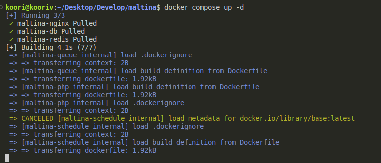

## Assumptions

1. I imagined that each product only accepts one group of types. If the number of type groups was unlimited, I would use non-relational databases.
2. Instead of using real jwt, we send a number in the Authorization header. (`JwtChecker::class`)

## Installation


*Installation will take several minutes, be patient.*

1. Install docker via official document
2. setup your `.env`
3. Run `docker composer up -d`. you can use mirror registry for pulling image like as [docker.ir](https://docker.ir/).

### Attention
1. Set `maltina.local` and `mail.maltina.local` in your `hosts` file. which should point to 127.0.0.1
2. In `docker compose` we mounted all entire files with container, ***so we override the file permissions*** and need add permission to `storage` and `bootstrap` manually (in real project, we don't sync these directories).
3. If you want to use https. Place the corresponding keys in [path](./.docker/nginx/ssl/) and activate [this](./.docker/nginx/conf.d/maltina.old) and [this](./.docker/nginx/conf.d/mail.maltina.old) configurations, then restart nginx.

## Running test

for run test follow this steps:

*create test database **(only first time)***
1. use `docker exec -it maltina-db bash`
2. use `mariadb -u root -p`
3. use `create database maltina_test;`
4. use twice `exit`

*run tests*
```shell
docker exec -it maltina-php php artisan test --testsuite Feature --path tests/Feature/
```

### Postman

```shell
https://www.postman.com/maltina/workspace/challenge
```